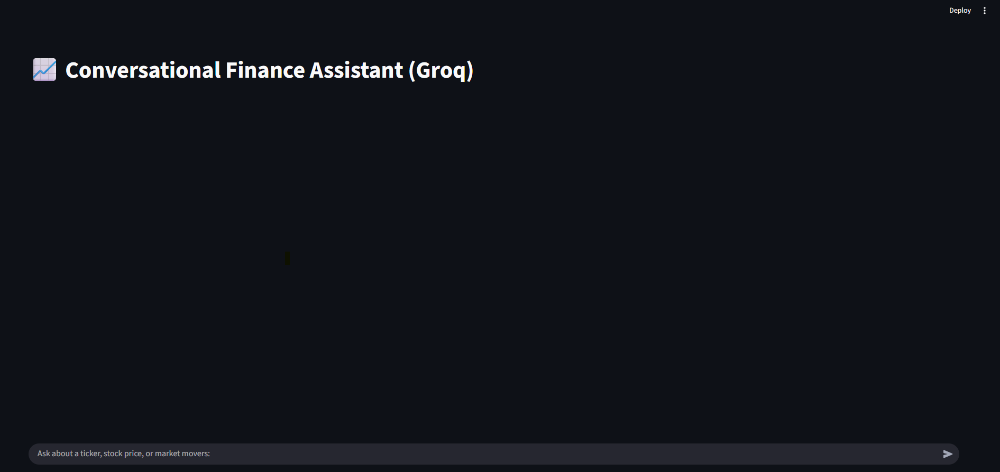

# 💹 FinChatX — Conversational Finance Analyst (LangChain + MCP + Groq)

> **FinChatX** is an **agentic finance assistant** powered by **LangChain**, **Groq API**, **FastMCP**, and **Streamlit**.  
> It acts as an intelligent analyst capable of fetching live stock data, market movers, and financial news —  
> combining **MCP tool orchestration**, **asynchronous workflows**, and a **LangGraph-inspired architecture**.

---

##  Overview

**FinChatX** simulates an **autonomous financial analyst** system integrating modern AI and multi-agent design principles.  
It demonstrates how to combine *LLM reasoning*, *tool calling*, and *async MCP workflows* for real-world financial data retrieval.

-  **LangChain AgentExecutor** for reasoning and decision-making  
-  **MCP (Model Context Protocol)** for dynamic tool routing  
-  **Groq LLMs** (Llama 3.1/3.3) for ultra-fast inference  
-  **Streamlit UI** for user interaction and visualization  
-  **Asynchronous backend** for concurrent execution of tools  

---

##  System Architecture

User Query → Streamlit UI
↓
LangChain AgentExecutor (Groq model)
↓
Response → Streamlit display + contextual follow-up suggestions


**Workflow Summary:**
1. User enters a question or ticker in Streamlit UI.  
2. The LangChain agent calls the **Groq LLM (via API)** for reasoning.  
3. If needed, the agent invokes an **MCP tool** (like `get_price`) through FastMCP.  
4. Tool results are processed and displayed interactively with suggestions.

---


## 🧩 Core Components

| File | Description |
|------|--------------|
| **`fin_langchain_groq.py`** | Main LangChain agent logic, Groq model initialization, memory, and async executor. |
| **`fin_server_v2_groq.py`** | MCP-compliant FastAPI server exposing finance tools for data retrieval. |
| **`streamlit_app.py`** | Front-end chat interface with async event loop handling. |
| **`test_file.py`** | Example script to test MCP tool invocation and LangChain agent execution. |
| **`.env`** | Contains API keys (excluded from repo; see `.env.example`). |

---


##  APIs & External Services

FinChatX integrates multiple APIs and cloud endpoints to enable real-time financial insights and intelligent reasoning:

| **Service** | **Type** | **Usage in Project** | **Notes** |
|--------------|-----------|----------------------|------------|
| **Groq Cloud API** |  LLM Inference | Powers the LangChain agent using **Llama 3.1 8B Instant** for reasoning, summarization, and conversational logic. | Selected for its extremely low latency and production-ready performance. |
| **Finnhub API** |  Financial Data | Provides live stock quotes, market movers, and company metadata through secure API calls. | Used during the MCP tool development for real-time market data retrieval. |
| **yfinance** |  Data Fetching Library | Retrieves historical OHLCV data and complements Finnhub results when rate limits apply. | Lightweight, open-source fallback ensuring consistent availability. |

---


🧩 **Example Streamlit UI:**  
## UI Preview


💻 **Test File Example:**

```bash
python test_file.py